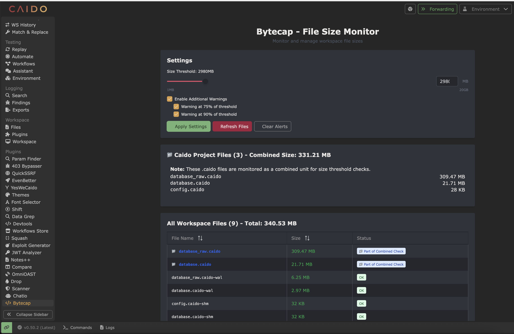

# Bytecap

<div align="center">

_Caido plugin to cap and split workspace files by size — ideal for proxy and log file uploads with file size limits_

[](https://github.com/GangGreenTemperTatum/Bytecap/network/members)
[](https://github.com/GangGreenTemperTatum/Bytecap/issues)
[](https://github.com/GangGreenTemperTatum/Bytecap/releases)
[](https://github.com/GangGreenTemperTatum/Bytecap/stargazers)
[](https://github.com/GangGreenTemperTatum/Bytecap/blob/main/LICENSE)

[Report Bug](https://github.com/GangGreenTemperTatum/Bytecap/issues) •
[Request Feature](https://github.com/GangGreenTemperTatum/Bytecap/issues)


*bytecap*

Bytecap is now available via the [Caido Plugin Library](https://caido.io/plugins)! 🥳 Bytecap was [submitted to the Caido Plugin Library](https://github.com/caido/store/pull/41) and is approved, it will be available for installation directly from the Caido plugin store page.


</div>

---

- [Bytecap](#bytecap)
  - [Overview](#overview)
  - [Quick Start](#quick-start)
    - [Prerequisites](#prerequisites)
    - [Installation](#installation)
    - [Method 1 - Install directly in Caido (recommended):](#method-1---install-directly-in-caido-recommended)
    - [Method 2 - Install from source (without auto-updates):](#method-2---install-from-source-without-auto-updates)
    - [Usage](#usage)
  - [Contributing](#contributing)
  - [License](#license)
  - [Star History](#star-history)

## Overview

Bytecap is a Caido plugin that helps you monitor and manage workspace file sizes. Perfect for scenarios where you need to upload proxy/logs or data files with strict size limits (IE certain pentesting platforms), Bytecap provides real-time file size monitoring with configurable thresholds and warnings.

> Come [join](https://discord.com/invite/Xkafzujmuh) the **awesome** Caido discord channel and come speak to me about Bytecap in it's [dedicated channel](https://discord.com/channels/843915806748180492/1407063905511145653)!

---

## Quick Start

### Prerequisites

- Caido (latest version)
- Node.js and pnpm (for development)

### Installation

### Method 1 - Install directly in Caido (recommended):

1. Open Caido, navigate to the `Plugins` sidebar page and then to the `Community Store` tab
2. Find `Bytecap` and click `Install`
3. Done! 🎉

### Method 2 - Install from source (without auto-updates):

1. **Clone the repository:**
   ```bash
   git clone https://github.com/GangGreenTemperTatum/Bytecap.git
   cd Bytecap
   ```

2. **Install dependencies:**
   ```bash
   pnpm install
   ```

3. **Build the plugin:**
   ```bash
   pnpm build
   ```

4. **Install in Caido:**
   - Open Caido
   - Go to Settings > Plugins
   - Click "Install from file"
   - Select the built plugin file from the `dist/` directory

### Usage

1. **Access Bytecap:**
   - After installation, find "Bytecap" in your Caido sidebar
   - Click to open the file size monitoring interface

2. **Configure your settings:**
   - Use the slider to set your file size threshold (1-20GB)
   - Enable additional warnings for 75% and 90% thresholds
   - Click "Apply Settings" to activate threshold monitoring
   - Click "Refresh Files" to scan your workspace

3. **Monitor your files:**
   - View all workspace files in the sortable table
   - Check color-coded status indicators
   - Review alerts and warnings for files exceeding threshold


*bytecap notification*


*bytecap notification*

## Contributing

1. Fork the repository
2. Create your feature branch (`git checkout -b feature/amazing-feature`)
3. Commit your changes (`git commit -m 'Add some amazing feature'`)
4. Push to the branch (`git push origin feature/amazing-feature`)
5. Open a Pull Request

## License

This project is licensed under the MIT License - see the [LICENSE](LICENSE) file for details.

## Star History

[](https://star-history.com/#GangGreenTemperTatum/Bytecap&Date)

---

<div align="center">
Made with ❤️ for the Caido community and angry pentesters
</div>
